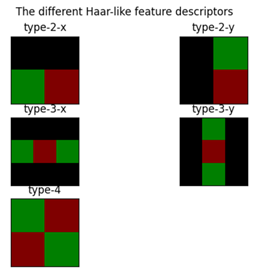
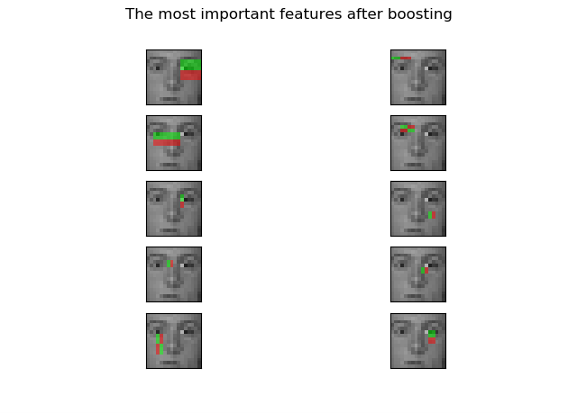
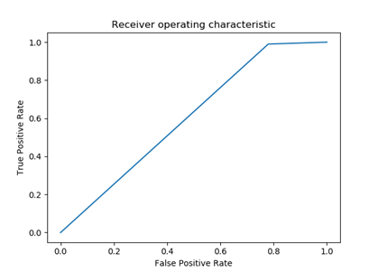

# Viola-Jones-Face-Recognition

AIM:
To analyse and select ideal set of weak_classifiers and make one strong classifiers that correctly classifies two objects namely face and non_face. By manipulation of assigned weights ,  the priority to the most accurate classification is achieved.
DATA:
The data is taken from the moodle folder consisting of 16*16 grayscale images.There was 5175 face images and 10000 non face images. For training the classifiers, face images indexed between 1600 and 2700, and non face images indexed 2700 and 4800 were used. That’s a total of 3200 images.
For testing the classifier,  face images indexed between 1600 to 1700 and non face images indexed 2700 t0 2800 were used. That’s a total of 200 images.
On running the adaboost for 10 best classifiers, an accuracy of 88.5% was achieved with the code.
 
HAAR:
An inbuilt code for haar feature extraction and plotting was available in scikit learns open source materials.
https://scikit-image.org/docs/dev/auto_examples/applications/plot_haar_extraction_selection_classification.html
The following kernels were used in the code.

 
ADABOOST:
The adaboost algorithm was implemented as in the pdf available from moodle.
The output for visualizing 10 best classifiers from adaboost is,

The ROC plot for the curve is

 
